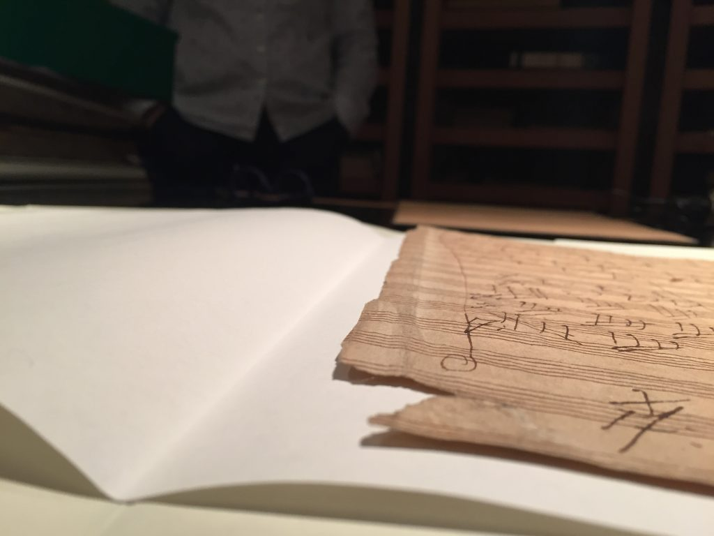

Einige in den Monaten Juli bis September durchgeführte Quellen-Autopsien haben zu neuen Erkenntnissen bzgl. des [Varianten-Beispiels zur 8. Symphonie] geführt. Durch Wasserzeichen-Bestimmungen der Berliner Werkniederschrift des 1. Satzes (Staatsbibliothek zu Berlin – Preußischer Kulturbesitz, Musikabteilung mit Mendelssohn-Archiv: Mus. ms. autogr. Beethoven 20/1) und des Bonner Blattes (Beethoven-Haus: Slg. H.C. Bodmer, HCB BMh 8/48) konnte definitiv festgestellt werden, dass das erwähnte Blatt nie zur Berliner Werkniederschrift gehört hat – wie noch im neuen Beethoven-Werkverzeichnis behauptet wurde. Entsprechende Änderungen der VideApp werden so bald wie möglich eingearbeitet.
Das Team des Projekts bedankt sich bei Clemens Brenneis für die freundliche Unterstützung.

<figure>
    
    <figcaption>Detailaufnahme des Bonner Blattes</figcaption>
</figure>

[Varianten-Beispiels zur 8. Symphonie]: https://videapp-var.beethovens-werkstatt.de/8b635772