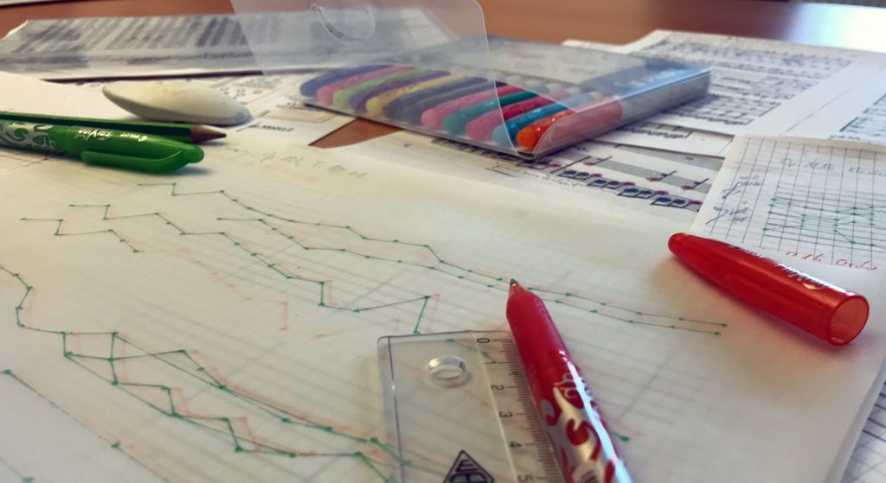

Auch im zweiten Modul zu Beethovens Eigenbearbeitungen stellt uns die Vermittlung von Erkenntnissen und die Entwicklung entsprechender digitaler Tools vor besondere Herausforderungen. Dabei soll vor allem das deiktische Potenzial digitaler Medien ausgenutzt werden.
Deshalb wurde in den letzten Wochen zunächst analog mit Papier und Buntstiften eine Möglichkeit der Darstellung entwickelt, von der sich Beethovens Werkstatt eine rasche Orientierung und zugleich einen Erkenntnisgewinn verspricht. Das Modell des Stimmkontur-Vergleichs, das einen abstrakten Vergleich zweier Fassungen eines Werkes darstellt, soll nun in ersten Versuchen digital umgesetzt werden. Dabei sollen die Stimmverläufe beider Fassungen als lineare Graphen abgebildet und übereinander gelegt werden können, sodass Unterschiede und Übereinstimmungen schnell lokalisierbar sind, ohne bereits eine Detailbetrachtung des Notentextes vorauszusetzen.

<figure>
    
    <figcaption>Analoge Entwürfe zum neuen Darstellungsmodus von Stimmkonturen für das zweite Modul</figcaption>
</figure>