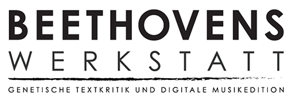

# Publications of Beethovens Werkstatt

This repository contains publications from the research project _[Beethovens Werkstatt] - Genetische Textkritik und Digitale Musikedition_. 
The research project - funded by the _[Akademie der Wissenschaften und der Literatur Mainz]_, - sees itself as a contribution to basic musicological research and at the same time aims to develop concepts and solutions in the field of digital humanities at the interface of musicology and applied computer science.

## Organization of the repository

* **Glossary articles**: The philological terms presented here reflect the current state of Beethoven's Workshop project-specific terminology.
* **Publications**: Articles, reports, explanatory texts etc. produced during the work of the research project
* **Posters**: presentations in the form of posters at public events, especially conferences
* **News articles**: Events and updates of the research project

## License

This work is licensed under a [Creative Commons Attribution 4.0 Unported License (CC BY 4.0)]

[Beethovens Werkstatt]: https://beethovens-werkstatt.de/
[Akademie der Wissenschaften und der Literatur Mainz]: https://www.adwmainz.de/startseite.html
[Creative Commons Attribution 4.0 Unported License (CC BY 4.0)]: https://creativecommons.org/licenses/by/4.0/
