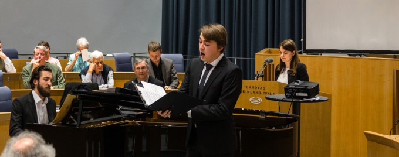

# Ludwig van Beethoven – Einblicke in die Komponisten-Werkstatt

<figure>
    
    <figcaption>Photo: Ernst-Dieter Hehl</figcaption>
</figure>

Am 5. Juli 2016 um 20:00 Uhr lädt das Projekt Beethovens Werkstatt zu einem Konzertabend im Mainzer Landtag ein. Dabei werden Grundkonzepte und Arbeitsweisen des Forschungsvorhabens vorgestellt:

Bernhard R. Appel und Maja Hartwig:
<em>Was erzählt Beethovens Handschrift zur Klaviersonate op. 111 über ihren Entstehungsprozess?</em>
<em>Fragestellungen der genetischen Textkritik.</em>

Joachim Veit und Elisa Novara:
<em>Beethovens Arbeit an einem wirkungsvollen Abschluss des Liedes „Neue Liebe, neues Leben“, op. 75/2.</em>
<em>Warum sich die digitale Musikedition vom bedruckten Papier verabschiedet.</em>

Die Vorträge werden von folgenden Musikstücken umrahmt:

Ludwig van Beethoven
<em>Klaviersonate c-Moll</em> op. 111

Thomas Wypior, Klavier

Ludwig van Beethoven
<em>Neue Liebe, neues Leben</em> op. 75/2, Text von Johann Wolfgang von Goethe

Liederzyklus An die ferne Geliebte op. 98, Texte von Alois Jeitteles

Konstantin Ingenpaß, Bariton
Thomas Wypior, Klavier

Weitere Informationen [hier].

[hier]: https://www.adwmainz.de/veranstaltungen/kalender/eintrag/musik-im-landtag-ludwig-van-beethoven-einblicke-in-die-komponisten-werkstatt.html