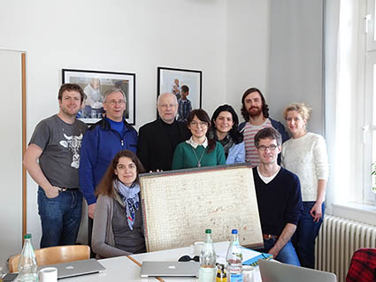

Vom 13.–16.03.2018 fand das erste Projekt-Arbeitstreffen des Jahres in der Landesmusikakademie Rheinland-Pfalz in Engers statt. Zunächst wurden Neuerungen in der VideApp, die in den letzten Monaten vorgenommen worden waren, besprochen. Dazu gehörte neben Änderungen an den einzelnen Fallbeispielen die Erarbeitung einer Tour, mit deren Hilfe der Nutzer durch die Anwendung geführt wird – eine neue Version der VideApp wurde im Anschluss an das Arbeitstreffen im März 2018 online gestellt.
Im Mittelpunkt des Treffens standen jedoch die Arbeiten zum zweiten Modul: Erste Visualisierungsversuche wurden ausgetauscht und diskutiert, konkrete Arbeitsabläufe konnten geplant und bearbeitete Materialien beurteilt werden. Daneben wurde über für das Modul relevante Begriffe, wie Substanzgemeinschaft, Identität, Ähnlichkeit, etc., gesprochen. All dies geschah unter Hinzuziehung konkreter Beispiele (Klaviersonate op. 14/1 und ihre Streichquartettfassung, Opferlied op. 121b und Bundeslied op. 122 mit den zugehörigen Klavierauszügen sowie Große Fuge op. 133 und die Bearbeitung für Klavier zu vier Händen). Zudem wurden neben den diesjährigen Konferenz-Teilnahmen auch Pläne zum Beethoven-Jubiläum im Jahr 2020 besprochen. An einem Nachmittag besuchte Jens Dufner die Arbeitsgruppe, mit dem dann über die Konzepte und Begrifflichkeiten des zweiten Moduls diskutiert wurde.
Große Freude bereitete das 1500-teilige Puzzle einer Manuskriptseite aus Beethovens Werkniederschrift zum zweiten Satz des Streichquartetts op. 59/3 (S. 18, Beethoven-Haus Bonn BH 62), welches innerhalb des letzten Jahres mit großartiger (aber anonym bleibender) Unterstützung fertiggestellt wurde (siehe Foto).
<figure>
    
    <figcaption>Arbeitstreffen in Engers</figcaption>
</figure>