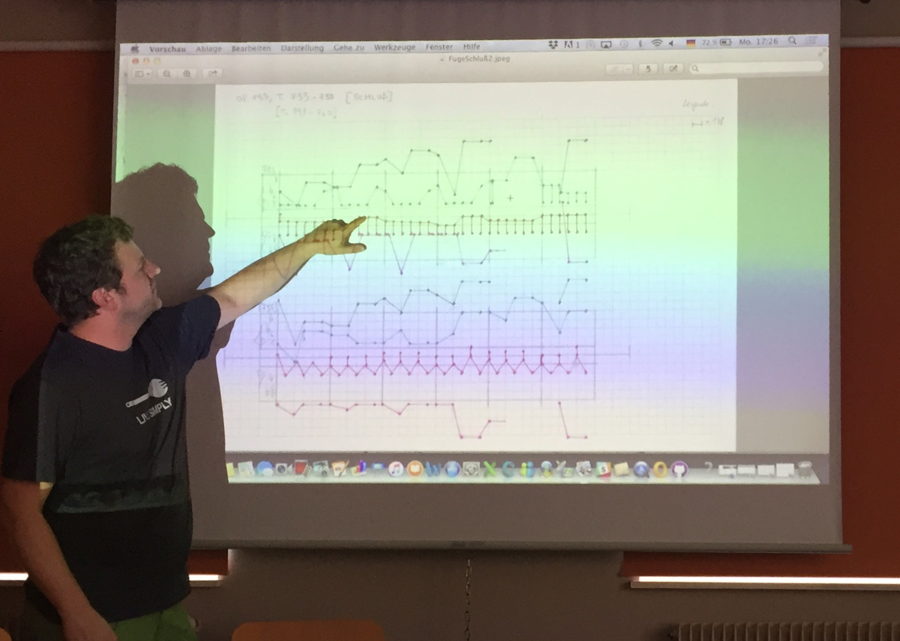

Vom 20.–23.08.2018 haben sich die Projekt-Mitarbeiter:innen zum zweiten jährlichen Arbeitstreffen im Château du Liebfrauenberg (Elsass) zusammengefunden. Im Mittelpunkt der Gespräche stand das prototypische Werkzeug zum zweiten Modul. Mit dieser neuen Anwendung wird eine Darstellung von Invarianz- und Varianz-Phänomenen automatisch erzeugt, die multiperspektivisch gehalten werden soll, so dass Beethovens Bearbeitungsmaßnahmen aus verschiedenen Blickwinkeln betrachtet werden können. In dem Zusammenhang wurden wie üblich auch konkrete Beispiele (die Klaviersonate op. 14/1 und ihre Streichquartettfassung, Opferlied op. 121b und Bundeslied op. 122 mit den zugehörigen Klavierauszügen, die Große Fuge op. 133 mit der entsprechenden vierhändigen Klavierbearbeitung sowie das Violinkonzert op. 61 und seine Bearbeitung als Klavierkonzert) diskutiert. Ein Teil des Gesprächs war den Glossar-Begriffen gewidmet, die auch im zweiten Modul eine wichtige Rolle spielen werden. Agnes Seipelt, Mitarbeiterin des Projekts „[Digitale Musikanalyse mit den XML-Techniken der Music Encoding Initiative (MEI)] am Beispiel der Kompositionsstudien Anton Bruckners“, nahm am Arbeitstreffen teil, um den Austausch zwischen den Projekten zu fördern. Ab dem 21. August kam auch Jan-Peter Voigt, der Beethovens Werkstatt bei der Softwareentwicklung unterstützt, zu Besuch. Weitere Pläne zu den nächsten Tagungen und Veranstaltungen (auch im Hinblick auf das Beethoven-Jubiläumsjahr 2020) wurden während des Treffens besprochen.
<figure>
    
    <figcaption>Arbeitstreffen</figcaption>
</figure>

[Digitale Musikanalyse mit den XML-Techniken der Music Encoding Initiative (MEI)]: https://www.oeaw.ac.at/de/acdh/forschung/musikwissenschaft/forschung/projektarchiv/digitale-musikanalyse-mit-mei