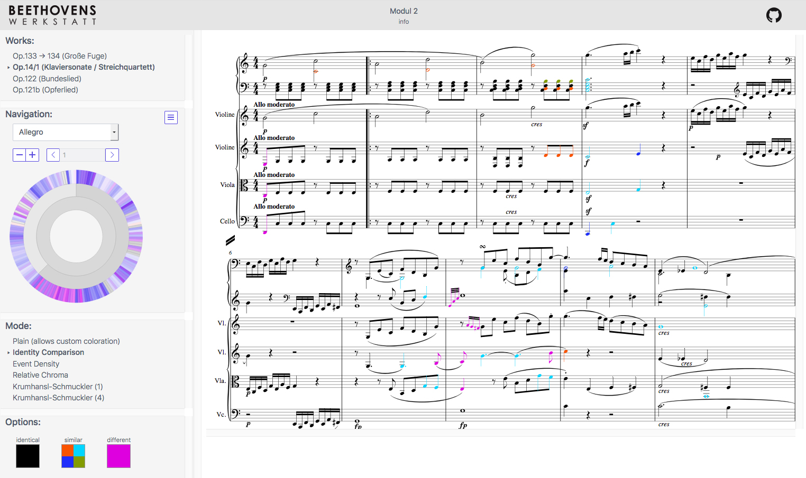
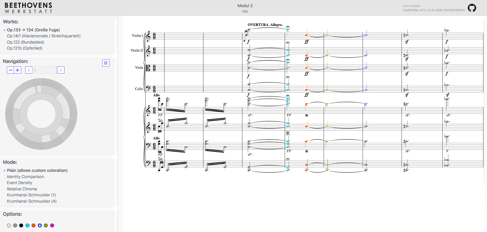

„Beethoven als Bearbeiter eigener Werke“ lautet der Titel des zweiten Moduls, mit dem ein weiterer Aspekt des kompositorischen Denkens bei Beethoven durch die Kombination mit digitalen Methoden in neuartiger Weise erforscht werden soll. Variantenbildung war das Kernthema des ersten Moduls, dessen Ergebnisse auch in den jetzigen Arbeiten sichtbar werden. Denn Bearbeitungsmaßnahmen sind Teil des kompositorischen Alltags Beethovens und somit im weitesten Sinne Varianten auf einer Makroebene. Die im Glossar erarbeiteten Definitionen des ersten Moduls werden demnach nun ggf. um neue Aspekte ergänzt.
Ziel des zweiten Moduls ist, neben der Entwicklung eines Werkzeugs zum weitgehend automatischen Vergleich von verschiedenen Fassungen eines Werks, das Erproben der Darstellungsmöglichkeiten von Ähnlichkeitsbeziehungen zwischen Fassungen sowie die Implementierung einer Audio-Komponente. Neben diesen Analysemöglichkeiten soll innerhalb der digitalen Darstellung der Werke auch eine musikalische Suchfunktion eingebaut werden – diese befindet sich allerdings noch in der Planungs- und Definitionsphase. Voraussetzung für die Entwicklung entsprechender Werkzeuge sind klar definierte methodische Ansätze, deren Gestaltung und Umsetzung – wie bereits festzustellen war – intensive Diskussionen erfordern.
Ein erstes Werkzeug zum Fassungsvergleich und zur Visualisierung von Ähnlichkeitsbeziehungen befindet sich in der Entwicklungs- und Testphase und wird zeitnah auf unserer Webseite bereitgestellt. Eine integrierte Funktion soll die farbliche Hervorhebung von „Invarianz“ bzw. „Differenz“ und „Varianz“ (verschiedener Abstufungen) sein. Darüber hinaus werden eine Visualisierung der „rhythmischen Ähnlichkeiten bzw. Übereinstimmungen“ (hier vorerst als „event density“ = Ereignisdichte bezeichnet) und erste Ansätze einer automatischen harmonischen Analyse angestrebt.
Derzeit werden folgende Werke in den Blick genommen: Op. 14/1 (Klaviersonate und Bearbeitung für Streichquartett), Op. 133/134 (Große Fuge für Streichquartett und Bearbeitung für Klavier zu vier Händen) sowie Op. 121b (Opferlied mit Klavierauszug) und Op. 122 (Bundeslied mit Klavierauszug). Geplant ist auch eine Behandlung des Violinkonzerts D-Dur op. 61 mit der Bearbeitung als Klavierkonzert sowie der Bearbeitung des Septetts Es-Dur op. 20 als Klaviertrio Es-Dur op. 38. An diesem Fall sollen in Zusammenarbeit mit dem Zentrum für Musik- und Filminformatik der Hochschule für Musik in Detmold auch Formen der Einbindung der Audio-Komponente erprobt werden.
Gegenwärtig werden die Funktionen und die Stabilität des Prototyps geprüft, um die Anzeige korrekter Daten zu gewährleisten, Erkenntnisse bezüglich des Vergleichs zweier Fassungen auszuarbeiten und um eine nutzerfreundliche und möglichst intuitive Oberfläche zu gestalten.
<figure>
    
    <figcaption>Vergleich der zwei Fassungen von Op. 14/1 auf der Ebene von Einzelnoten (in den oberen Systemen die Fassung für Klavier, in den unteren Systemen die Bearbeitung für Streichquartett)</figcaption>
</figure>
In dem hier ausgewählten Modus werden Varianzen und Differenzen automatisch eingefärbt, invariante Noten sind schwarz. (Es ist zu beachten, dass sich der Name der Funktion sowie die Anzeige im Entwicklungsprozess befinden und wahrscheinlich noch verändert werden.)
Darüber hinaus ist geplant, dass Nutzer:innen Einfärbungen auch selbstständig vornehmen und speichern kann. Dieses Prinzip ähnelt dem der [Genetic Sandbox] aus dem ersten Modul; der Unterschied besteht darin, dass die Mitarbeiter:innen sich in der jetzigen Phase mit gedruckten Notentexten anstelle von Manuskripten beschäftigen. In der oberen rechten Ecke der Kopfzeile wird beim Anklicken eines events (Note, Pause) wie in der Sandbox die Identifikationsnummer aus der XML-Datei angezeigt, die dadurch wiederum in der MEI-Codierung leicht auffindbar und bearbeitbar ist.
<figure>
    
    <figcaption>Vergleich der beiden Fassungen der Großen Fuge mit individuellen Einfärbungen einer Nutzerin</figcaption>
</figure>
Die Mitarbeiter:innen von Beethovens Werkstatt haben sich zu Beginn des zweiten Moduls bewusst für eine prototypische Entwicklung des Werkzeugs entschieden, da sich die Arbeiten sowohl technisch als auch inhaltlich noch in der Erprobungsphase befinden. Veränderungen und Verbesserungen können somit einfacher vorgenommen werden.

[Genetic Sandbox]: https://beethovens-werkstatt.de/genetic-sandbox/