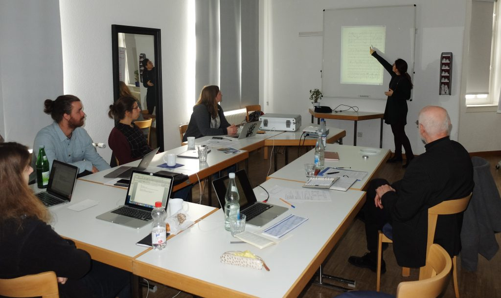

Vom 25.–28. Februar 2019 fand das erste Projekt-Arbeitstreffen des Jahres in der Landesmusikakademie Rheinland-Pfalz in Engers statt. Im Zentrum stand die Arbeit an der im zweiten Modul („Beethoven als Bearbeiter eigener Werke“) entwickelten digitalen Anwendung zum Vergleich zweier Fassungen eines Werks. In diesem prototypischen Werkzeug können die Originalfassung und Beethovens Bearbeitung mithilfe verschiedener Darstellungsmodi aus unterschiedlichen Perspektiven betrachtet und verglichen werden. Beim Arbeitstreffen wurde über die Nutzeroberfläche des Prototyps diskutiert sowie über Begriffe und methodische Konzepte, die mit Fassungsvergleichen verbunden sind. Daneben wurden erste Überlegungen zu einer Suchfunktion angestellt, die noch Teil des Werkzeugs werden soll.
Des Weiteren wurde das Konzept des Roundtables zum Thema „Skizzen als Werkstattdokumente: Schaffensprozesse im Vergleich“ ausgearbeitet: Beethovens Werkstatt gestaltet diesen Roundtable im Rahmen des Kongresses „Beethoven-Perspektiven“, der vom Beethoven-Archiv anlässlich des Beethoven-Jubiläums 2020 abgehalten wird.
An einem Nachmittag besuchte Jens Dufner die Arbeitsgruppe, um über textgenetische Begrifflichkeiten des zweiten Moduls sowie über die aktuellen Arbeiten an der digitalen Anwendung zu diskutieren. Zudem nahm Agnes Seipelt, Mitarbeiterin des Projekts „[Digitale Musikanalyse mit den XML-Techniken der Music Encoding Initiative (MEI)] am Beispiel der Kompositionsstudien Anton Bruckners“, am Arbeitstreffen teil, mit dem Ziel den Austausch zwischen den Projekten zu fördern. Abschließend wurde mit Blick auf das dritte Modul zum Thema „Originalausgaben, variante Drucke und Beethovens Korrekturlisten“ geplant, welche Vorarbeiten parallel zum Abschluss des zweiten Moduls in Angriff genommen werden können.
<figure>
    
    <figcaption>Arbeitstreffen vom 25.–28. Februar 2019 in der Landesmusikakademie Rheinland-Pfalz in Engers</figcaption>
</figure>

[Digitale Musikanalyse mit den XML-Techniken der Music Encoding Initiative (MEI)]: https://www.oeaw.ac.at/de/acdh/forschung/musikwissenschaft/forschung/projektarchiv/digitale-musikanalyse-mit-mei