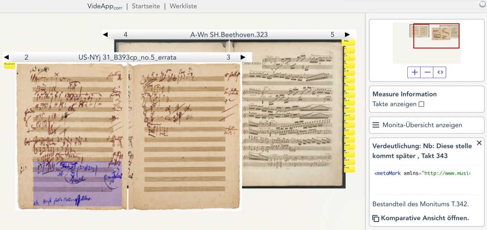
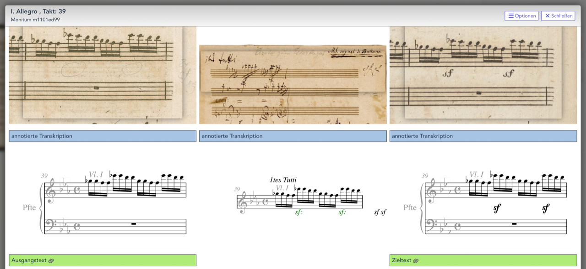
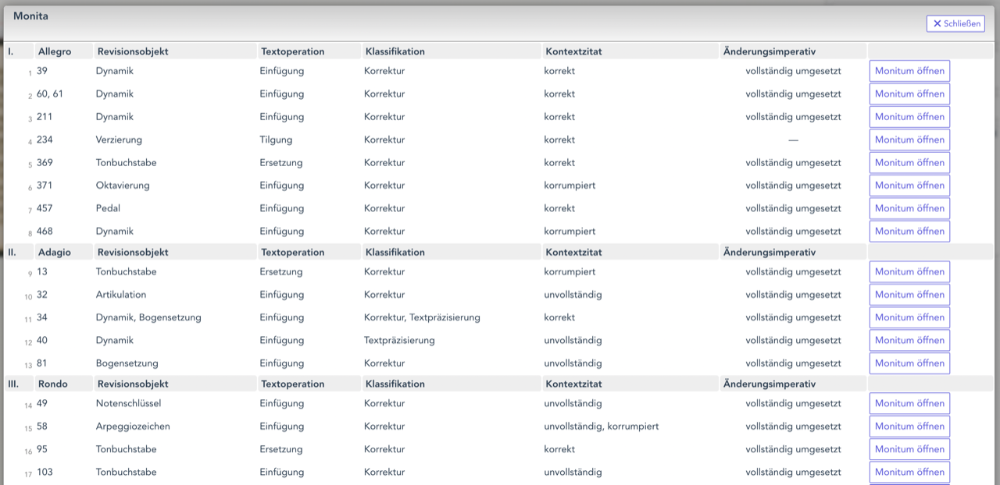

Bei einem Treffen am 22./23. November 2021 in Bonn konnte ein wichtiger Zwischenschritt auf dem Weg zum Abschluss des dritten Moduls vorgestellt werden. Die Entwicklungsarbeiten an der aktuellen [VideApp] sind nun fast abgeschlossen. Auch die darin enthaltenen Daten zur Revisionsphase von Beethovens 5. Klavierkonzert (Op. 73) sind inzwischen so weit überprüft, dass wir gerne auf die [Zwischenversion] hinweisen möchten – verbunden mit dem Hinweis, dass dieser Stand kontinuierlich aktualisiert wird. In den kommenden Wochen werden wir dort auch die im Modul ebenfalls bearbeiteten Revisionen zu den Diabelli-Variationen (Op. 120) ergänzen. Wir freuen uns darauf, dieses [Modul] nach Abschluss dieser letzten Arbeiten in einigen Wochen komplett vorstellen zu können. Bis dahin können Sie uns gerne Rückmeldungen oder Anregungen zum bereits erreichten Stand per [Email] zukommen lassen.

<figure>
    
    <figcaption>"Schreibtisch-Ansicht" der VideApp</figcaption>
</figure>

<figure>
    
    <figcaption>"Komparative Ansicht" zum Vergleich eines Textsegments in Ausgangs-, Revisions- und Zieldokument</figcaption>
</figure>

<figure>
    
    <figcaption>Auflistung aller Monita eines Revisionsdokuments</figcaption>
</figure>

[VideApp]: https://videapp.beethovens-werkstatt.de/
[Zwischenversion]: https://videapp.beethovens-werkstatt.de/work/xf3f76067-b8a1-48ce-878f-41b9a0ef0c8d
[Modul]: https://beethovens-werkstatt.de/modul-3/
[Email]: info@beethovens-werkstatt.de
